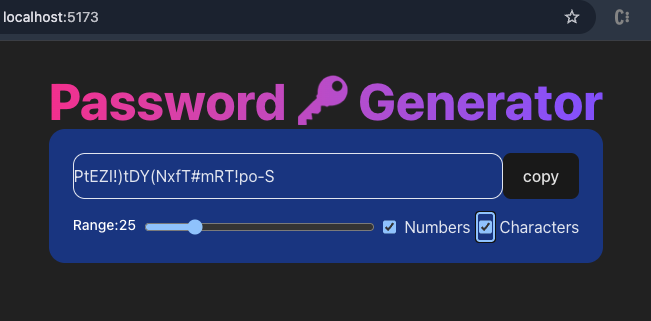

# 🔐 Password Generator

A sleek and customizable password generator built with React. Instantly generate secure passwords with the option to include numbers and special characters. Designed for simplicity, usability, and performance.

## 📸 Preview


## 🚀 Features

- 🔄 Auto-generates password on config changes
- 🔢 Adjustable password length (6–100)
- 🔣 Option to include numbers and special characters
- 📋 One-click copy to clipboard
- 💅 Modern UI with Tailwind CSS

## 🛠️ Tech Stack

- **React** – Functional components with hooks
- **Tailwind CSS** – Utility-first styling

## 🧩 How It Works

1. Adjust the password length using the slider.
2. Toggle the checkboxes to include:
   - Numbers (`0-9`)
   - Special characters (`!@#$%^&*()-_=+{}~``)
3. Password updates automatically with changes.
4. Click **copy** to copy the generated password.

## 📂 Getting Started

```bash
# Clone the repository
git clone https://github.com/your-username/password-generator.git

# Navigate to the project directory
cd password-generator

# Install dependencies
npm install

# Start the development server
npm run dev
