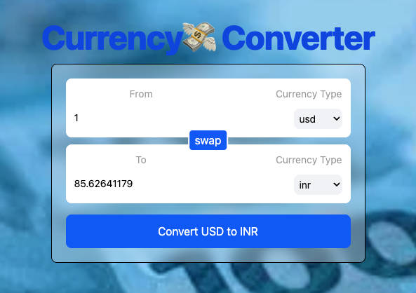

# 💸 Currency Converter

Convert currencies in real time with a clean UI, smooth interactions, and live exchange rates.  
Built with **React + Vite** and styled using **Tailwind CSS**.

> 🔁 Instantly swap currencies, enter custom amounts, and see updated results — all inside a beautiful, responsive layout.

---

## 📸 Preview


## ✨ Features

- 🔢 **Real-time currency conversion**
- 🔄 **Swap** From and To fields with a single click
- 🎛️ **Reusable InputBox component**
- 💡 Uses a **custom hook** for fetching rates: `useCurrencyInfo()`
- 🌄 Fullscreen background with glassmorphism effect
- 🚀 Powered by **React**, **Vite**, and **Tailwind CSS**

---

## 🔍 Concepts Covered

- ✅ `useState` for controlled form and dynamic values  
- ✅ **Custom Hooks** for clean API separation  
- ✅ **Component Composition** using props  
- ✅ Preventing default form behavior  
- ✅ Inline styling and `backgroundImage` usage  

---

## 🧪 Local Setup

```bash
# 1. Clone the repository
git clone https://github.com/your-username/react-mini-projects.git
cd react-mini-projects

# 2. Navigate to the currency converter project
cd currency-converter

# 3. Install dependencies
npm install

# 4. Start the development server
npm run dev
