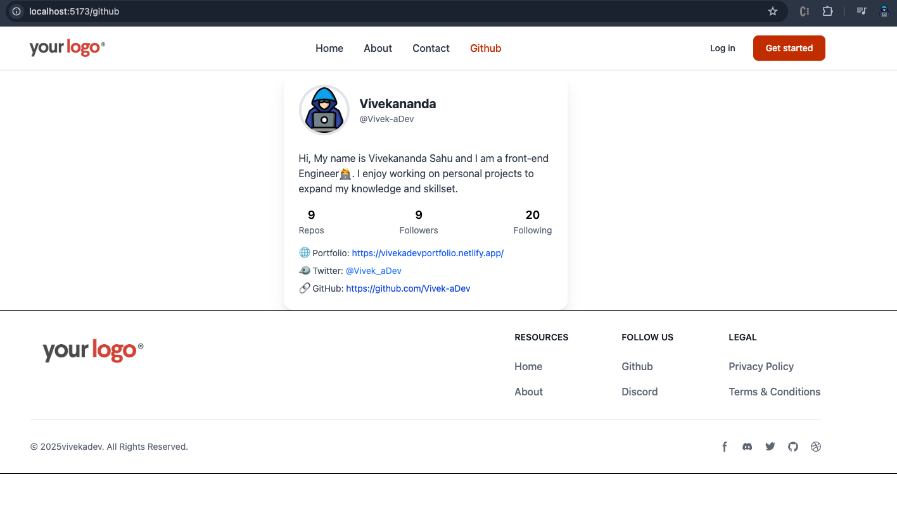

# 📦 React Router DOM Project

A multi-page React application using **React Router v6** to demonstrate modern routing, nested layouts, dynamic routes, and data fetching via loaders. Includes animated GitHub profile integration using live API data.

---
### 📸 Previews


### ✨ Features

- ✅ **Nested Layouts** with `Outlet`
- ✅ **Dynamic Routing** using `:userId`
- ✅ **Data Fetching** using `loader` for GitHub API
- ✅ **Component-Based Design**: Header, Footer, Pages
- ✅ **Responsive Navbar** with `NavLink` active styling
- ✅ **API**: Fetches GitHub user data via `https://api.github.com/users/Vivek-aDev`

---

### 📚 Concepts Covered

- 🧩 React Router v6 Routing System
- 🧵 Nested Routes with Layout Wrappers
- ⚙️ Data Loading via `loader` Functions
- 🧠 useLoaderData Hook for async data
- 🎨 Active Navigation Styling using `NavLink`
- 🔀 Route Params (`/user/:userId`) and dynamic UI
- 🔧 Project Structuring and File Organization
- 🌐 API Integration using GitHub REST API
- 🧱 Component Reusability and Separation of Concerns

---

### 🔍 Pages & Routes

| Route         | Component   | Description                     |
| ------------- | ----------- | ------------------------------- |
| `/`           | Home        | Landing page                    |
| `/about`      | About       | About the application           |
| `/contact`    | Contact     | Contact details or form         |
| `/user/:id`   | User        | Dynamic route for user profiles |
| `/github`     | Github      | Live GitHub API profile card    |

---

### 📦 Packages Used

- **react**
- **react-dom**
- **react-router-dom**
- **vite**
- **tailwindcss**

---

### 🔧 Local Setup

1. **Clone the Repository**

   ```bash
   git clone https://github.com/your-username/your-repo-name.git
