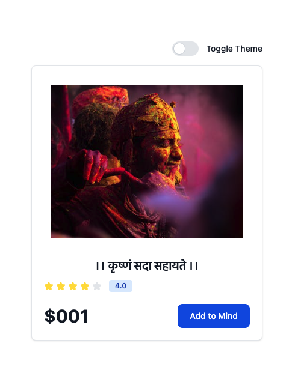
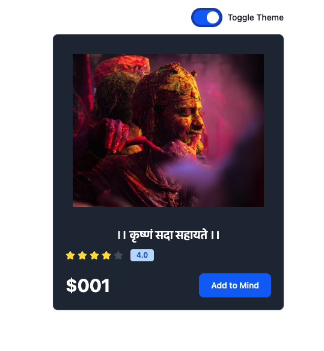

# 🌓 React Theme Toggle using Context API

A minimal and elegant project demonstrating how to implement **Dark/Light Mode** in a React application using the **Context API**. This project uses Tailwind CSS for smooth transitions and easy theming, making it ideal for learners and portfolio builders.

---
## 📸 Demo Preview



## ✨ Features

- 🌗 Toggle between Light and Dark Mode
- 🔁 Dynamic theme switching using React Context
- 🧠 Persistent theme state across components
- 💅 Beautiful card component with Tailwind CSS
- ⚡ Vite-powered fast development environment

---

## 🧠 Concepts Covered

| Concept             | Description                                                                  |
|---------------------|------------------------------------------------------------------------------|
| `Context API`        | Share and manage theme state globally across the app                         |
| `useContext` Hook    | Consume and modify context values in any component                           |
| `useState` Hook      | Handle the theme state (light/dark)                                          |
| `useEffect` Hook     | Apply theme class changes to the `<html>` element dynamically                |
| Tailwind CSS         | Class-based styling with dark/light variants                                 |
| Component Composition| Break down UI into reusable components like `ThemeBtn` and `Card`            |

---

## 🛠️ Tech Stack

- ⚛️ **React** – Functional components + Hooks
- 🌐 **Context API** – Global theme management
- ⚡ **Vite** – Lightning-fast dev server & build
- 💨 **Tailwind CSS** – Utility-first CSS framework
- 🧠 **Dark Mode** – Tailwind’s `dark:` variant system

---

## 🚀 Getting Started

```bash
# Clone the repo
git clone https://github.com/Vivek-aDev/i-am-ReactJS.git
cd i-am-ReactJS/09themeSwitcher

# Install dependencies
npm install

# Start the development server
npm run dev